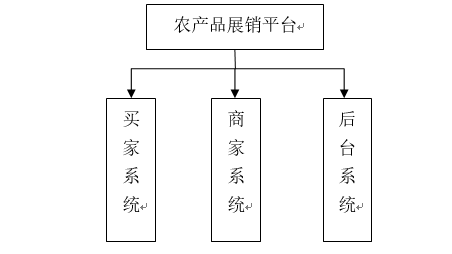
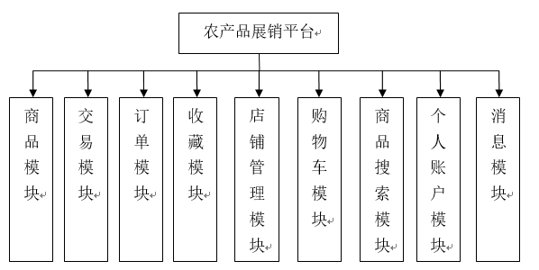
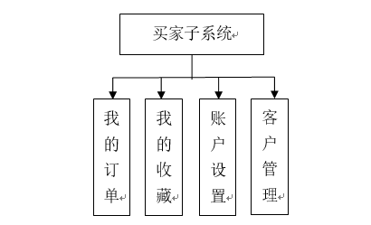
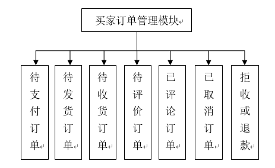
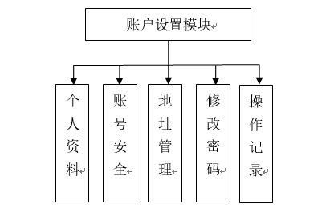
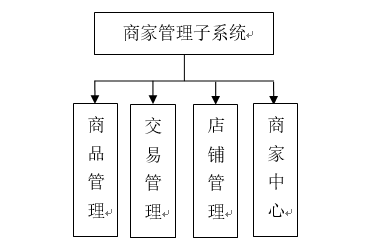
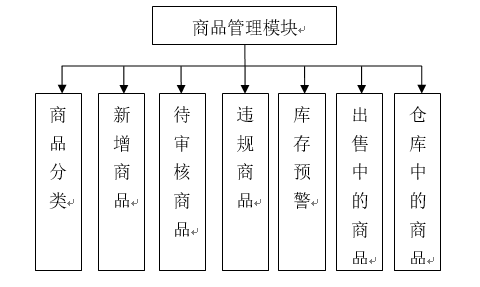
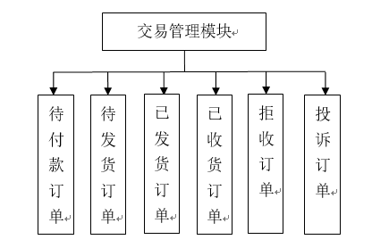
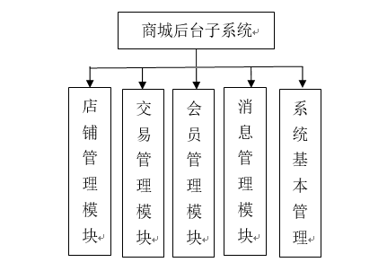

## 微农一体化服务平台（简称eshop）
### 项目完成时间2017-06-11
* 数据的设计说明见eshop数据库设计说明文档
* **项目结构说明**
#### 系统整体设计：分别为买家，商家，和管理员，具体如图1所示
> 
#### 系统总体功能模块：根据系统的具体功能来划分则包含商品模块、交易模块、订单模块、收藏模块、店铺管理模块、购物车模块、商品搜索模块、个人账户模块、消息模块等九大模块，如图2所示
> 
#### 系统子模块设计
##### 买家子系统：如图3所示
> 
1. 我的订单模块：用于用户管理自己的订单，包含待支付订单管理，待发货订单管理，待收货订单管理，待评价订单管理，已评论订单管理，已取消订单管理，拒收或退款订单管理具体模块，如图4所示
> 
2. 我的收藏模块：分别为店铺收藏，主要用于显示用户收藏的店铺列表，用户可以对收藏的店铺进行删除操作；商品收藏，主要用于显示用户收藏自己喜欢的商品
3. 账户设置模块：该模块主要用户对个人账户的基本信息进行相关的维护，具体包含个人资料：用户可以修改完善注册账号的基本信息，包括头像的上传和修改；账号安全：用于提示用户当前账号的安全系数，用户可以通过定期修改密码或邮箱绑定，手机号验证等措施提升账号安全；地址管理：用于管理用户日常的收货地址，包含地址的新增和删除；修改密码：用户密码修改；操作记录：记录日常的敏感操作日志信息，具体功能图如图5所示
> 
4. 客户管理模块：客户管理模块主要是用户对日常消息和投诉管理的。日常消息功能主要是用于显示系统各用户的消息提示或通知，比如当用户进行下单或付款等操作的时候系统就会自动发送一条消息给用户，提示用户相应订单的状态；投诉管理主要是显示用户投诉的订单或商家的处理状态，显示系统管理员是否对投诉进行受理或是否已经解决，当然用户也可以与商家进行私下沟通达成一致意见然后选择撤诉处理。
##### 商家后台子系统：如图6所示
> 
1. 商品模块管理：针对于商家管理本店铺所有商品的。具体功能模块如图7所示
> 
2. 交易管理模块：是商家针对本店铺交易订单进行的处理，主要是针对订单的发货处理和订单列表的显示，具体模块功能如图8所示
> 
3. 店铺管理模块：是商家对店铺进行日常维护的，具体包括店铺基本信息的修改，店铺资讯和优惠活动消息的发布，编辑，信息列表显示用户发布的所有的信息，店铺设置等具体的功能
4. 商家中心模块：是商家维护商家账号和日常消息记录的，便于商家管理自身账号，防止账号被盗取，在一定程度上提升商家注册账号的安全性，这个功能模块跟用户中心模块功能大体上相似
##### 商城后台子系统：完全独立于买家和用户子系统的主要对商城进行日常的管理和维护的，同时管理商城注册的所有用户和入驻的商家以及商城产生的一切活动，其包含的功能模块如图9所示
> 
1. 店铺管理：是系统对所有的商家进统计和管理，比如商家的审核，封号等操作
2. 交易管理模块：是系统对商城所有交易订单的管理。包括订单的统计，分类，查看，以及投诉订单的受理和仲裁等一系列的操作
3. 会员管理模块：是系统对商城所有注册会员的管理。包括会员信息的查看，会员删除、封号等相关操作
4. 消息管理和系统基本设置模块：主要针对的是系统的日常维护和商城广告，公告等基本消息的日常推送和更新，当然也包括对商城安全性的管理和数据的日常备份处理
